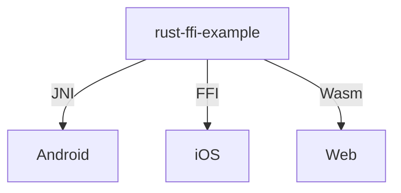

# rust-ffi-examples



## setup
```
$ cd randomizer
$ make setup
```
- Android
  - Android NDK: ASのSDK Toolsから手動で
- web
  - pnpm + next

## dependencies
- for Android
  - Android NDK
  - cargo-ndk
  - jni-rs

## TODO
- [x] サンプルアルゴリズムの実装
- [x] Androidでの実装
- [ ] Webでの実装
- [ ] iOSでの実装
- [ ] 開発環境の仮想化
- [ ] 配布周り