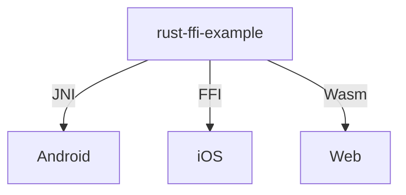

# rust-ffi-examples

```mermaid
graph TD
    A[rust-ffi-example] -->|JNI| B[Android]
    A -->|FFI| C[iOS]
    A -->|Wasm| D[Web]
```

## TODO
- [x] サンプルアルゴリズムの実装
- [ ] Androidでの実装
- [ ] Webでの実装
- [ ] iOSでの実装
- [ ] 開発環境の仮想化
- [ ] 配布周り